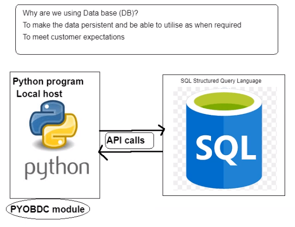

# Python with SQL

**Using PYODBC (python open database connectivity)**
- PYODBC is used to connect to SQL from the Python program

**What is a Cursor and how to use it?**
- Some functions that we can use to interact with SQL
data

- Make sure your latest odbc driver is installed
- Set up a pyodbc connection
- Command to install pyodbc `pip install pyodbc`